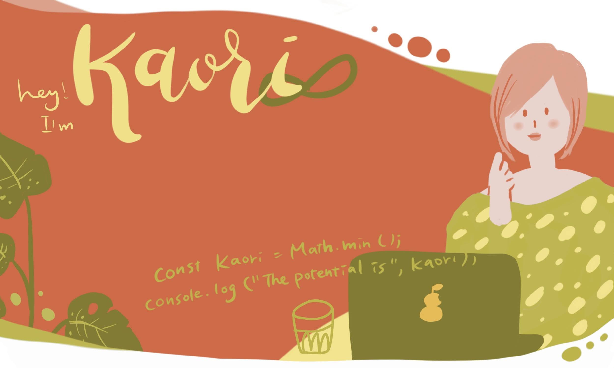

 

<h2>iOS(Swift) app: Kaori Shopify Store</h2>
A real online store back-ended by <a href="https://shopify.dev/" target="_blank">Shopify</a> using <a href="https://shopify.dev/custom-storefronts/tools/ios" target="_blank">Shopify buy iOS SDK</a> and graphQL.

<h3>Feature:</h3>
<dl>
<li>Live online store: Fetching product information by using GraphQL</li>
<li>Virtual Fitting Room: Trying on dresses by uploading/taking a photo</li>
</dl>

<a href="https://github.com/StudioKaori/iOSShopify">View repo</a>

 

<h2>Spring(Java) + React: Free Thinkers</h2>
A group project using Spring as a back-end, React as a front-end 
The concept is 'Primary school at Home' in corona time.
<h3>Feature:</h3>
<dl>
<li>Online Class Schedule: A teacher can schedule online classes and students can join them.</li>
<li>Gamified Assignment: Fun assignments with chat, and voice recognition. Students can see their progress on the world map.</li>
</dl>

<h3><a href="https://free-thinker-d732f.web.app/" target="_blank">View Demo</a></h3>  <h3><a href="https://github.com/StudioKaori/free-thinker"><a href="https://github.com/StudioKaori/free-thinker">View repo</a></h3>

 

<h2>Projects</h2>

  <b>
  [React group project]Teck Talk: https://tech-talk-6942d.web.app/  [<a href="https://github.com/StudioKaori/Tech-talk" target="_blank">Repo</a>] 
  [React personal project]Package tracker: https://sda-package-tracker.web.app/  [<a href="https://github.com/StudioKaori/new-package-tracker-React-assignment-" target="_blank">Repo</a>] 
  [HTML + CSS personal project] MUNAMI cakery: https://my-sda-c8ed9.web.app/munamii-cakery/  [<a href="https://github.com/StudioKaori/cakery" target="_blank">Repo</a>]
    </b>

